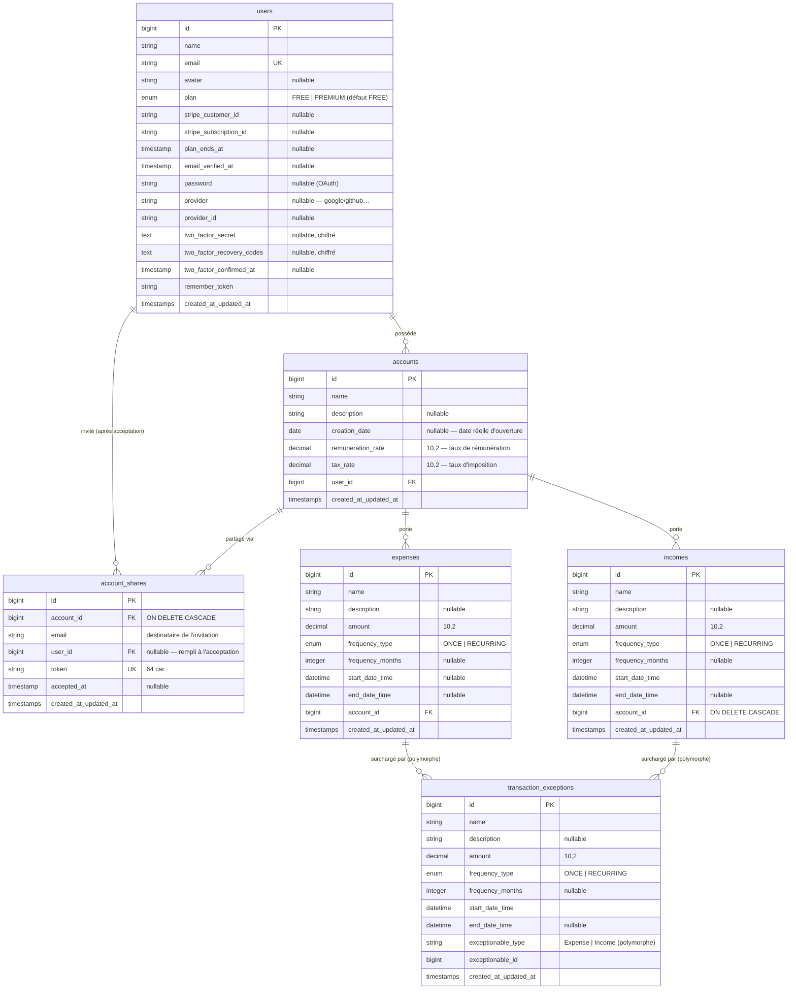

# Budgie — Schéma de base de données

Documentation du modèle de données de l'application **Budgie** (backend Laravel).
Budgie permet de gérer des **comptes** financiers (courant, épargne, livret…), d'y
attacher des **dépenses** et des **revenus** ponctuels ou récurrents, d'y appliquer des
**exceptions** ponctuelles, et de **partager** un compte en lecture seule avec d'autres
utilisateurs. Les prévisions de solde sont calculées mois par mois à partir de ces données.

---

## 1. Diagramme des relations (ERD)

> Le diagramme se rend automatiquement sur GitHub, GitLab et la plupart des éditeurs
> Markdown compatibles Mermaid.

---

## 2. Les tables

### `users` — Utilisateurs
Table centrale des comptes utilisateurs. Elle porte plusieurs préoccupations transverses :

| Domaine | Colonnes | Rôle |
|---|---|---|
| Identité | `name`, `email` (unique), `avatar` | Profil de base |
| Authentification | `password` (nullable), `provider`, `provider_id` | Login classique **ou** OAuth (Google/GitHub). Le mot de passe est nullable car un compte social n'en a pas. `(provider, provider_id)` est unique. |
| Vérification email | `email_verified_at` | Obligatoire pour se connecter |
| 2FA | `two_factor_secret`, `two_factor_recovery_codes`, `two_factor_confirmed_at` | Double authentification (secrets chiffrés en base) |
| Abonnement | `plan` (FREE/PREMIUM), `stripe_customer_id`, `stripe_subscription_id`, `plan_ends_at` | Facturation Stripe. Reste PREMIUM jusqu'à `plan_ends_at` même après résiliation. |

### `accounts` — Comptes financiers
Un compte appartient à **un** utilisateur (`user_id`). Il porte :
- `creation_date` : la **date réelle** d'ouverture du compte (ex. un Livret A ouvert en 2010),
  distincte de `created_at` (date d'enregistrement en base). C'est le point de départ des prévisions.
- `remuneration_rate` : taux de rémunération (intérêts). Un compte est « rémunéré » dès que ce taux est > 0.
- `tax_rate` : taux d'imposition appliqué aux intérêts.

### `expenses` — Dépenses
Sorties d'argent rattachées à un compte. `frequency_type` distingue une opération
**ponctuelle** (`ONCE`) d'une opération **récurrente** (`RECURRING`), auquel cas
`frequency_months` donne la périodicité (en mois). `start_date_time`/`end_date_time`
bornent la période d'application.

### `incomes` — Revenus
Structure **identique** aux dépenses : seul le **signe** change au moment du calcul des
prévisions. La FK `account_id` est en `ON DELETE CASCADE`.

### `transaction_exceptions` — Exceptions
Surcharge le montant d'une **dépense OU d'un revenu** sur une période donnée, **sans**
modifier le montant initial de la transaction. La surcharge n'est appliquée qu'au moment
du calcul des prévisions. La relation est **polymorphe** (`exceptionable_type` +
`exceptionable_id`) car une exception peut cibler indifféremment un `Expense` ou un `Income`.

### `account_shares` — Partages de compte
Invitation à consulter un compte en **lecture seule**. C'est d'abord une invitation par
`email` : le destinataire n'a pas forcément encore de compte Budgie, donc `user_id` reste
`null` jusqu'à l'acceptation (`accepted_at`). Contraintes : `token` unique, et
`(account_id, email)` unique — une seule invitation en cours par compte et par adresse.

### Tables techniques (Laravel)
Générées par le framework, hors métier : `password_reset_tokens`, `sessions`, `cache`,
`cache_locks`, `jobs`, `job_batches`, `failed_jobs`, `personal_access_tokens` (jetons
d'API Sanctum, relation polymorphe `tokenable`).

---

## 3. Résumé des relations

| Relation | Type | Détail |
|---|---|---|
| `users` → `accounts` | 1 — N | Un utilisateur possède plusieurs comptes (`hasMany`). Propriétaire = lecture + écriture. |
| `accounts` → `expenses` | 1 — N | `hasMany`. Pas de cascade SQL : nettoyage explicite dans `Account::deleting()`. |
| `accounts` → `incomes` | 1 — N | `hasMany`, `ON DELETE CASCADE`. |
| `accounts` → `account_shares` | 1 — N | `hasMany`, `ON DELETE CASCADE`. |
| `users` ↔ `accounts` (partage) | N — N | Via `account_shares`, filtré sur `accepted_at IS NOT NULL`. Lecture seule. |
| `expenses` / `incomes` → `transaction_exceptions` | 1 — N polymorphe | `morphMany` / `morphTo` sur `exceptionable`. |
| `users` → `account_shares` | 1 — N | L'invité une fois l'invitation acceptée (`nullOnDelete`). |

---

## 4. Points de conception

**Modélisation métier**
- **Dépenses et revenus symétriques.** Les deux tables ont la même forme ; le calcul des
  prévisions applique simplement `+` pour un revenu et `-` pour une dépense. Cela garde la
  logique de récurrence (`frequency_type` / `frequency_months`) identique des deux côtés.
- **Exceptions polymorphes plutôt que dupliquées.** Une seule table
  `transaction_exceptions` sert dépenses et revenus, évitant deux tables jumelles. L'exception
  ne mute jamais le montant d'origine : elle est appliquée au vol lors du calcul mois par mois,
  ce qui préserve l'historique et permet d'annuler une surcharge en supprimant simplement la ligne.
- **`creation_date` distincte de `created_at`.** On sépare la réalité métier (quand le compte
  a été ouvert) de la réalité technique (quand la ligne a été insérée). Indispensable pour
  saisir un compte existant et calculer des intérêts rétroactifs.

**Partage de comptes**
- Modèle **invitation-first** : on invite une adresse email, pas un utilisateur existant. Le
  lien vers `users` (`user_id`) ne se matérialise qu'à l'acceptation. Cela permet d'inviter
  quelqu'un qui n'a pas encore de compte. Un `token` unique sécurise le lien d'acceptation,
  et l'unicité `(account_id, email)` empêche les invitations en double.

**Authentification & sécurité**
- **Auth hybride** : mot de passe classique *ou* OAuth. `password` nullable + couple
  `(provider, provider_id)` unique gèrent proprement les deux cas sans table séparée.
- **2FA** : secrets et codes de récupération **chiffrés** en base (`encrypted` cast), activés
  seulement après confirmation (`two_factor_confirmed_at`).
- **Vérification d'email obligatoire**, avec un backfill rétroactif pour ne pas bloquer les
  comptes créés avant l'introduction de la règle.

**Intégrité référentielle**
- Les stratégies de suppression sont **mixtes** : cascade SQL sur `incomes` et
  `account_shares`, mais suppression **applicative** de la descendance d'un compte dans le hook
  `Account::deleting()` — nécessaire parce que `expenses` n'a pas de `ON DELETE CASCADE` et que
  les exceptions polymorphes ne peuvent pas porter de contrainte FK.

**Facturation**
- Intégration **Stripe** (`stripe_customer_id`, `stripe_subscription_id`). L'accès Premium
  suit `plan_ends_at` : la résiliation en cours de mois ne coupe pas l'accès immédiatement,
  l'utilisateur profite de la période déjà payée.
